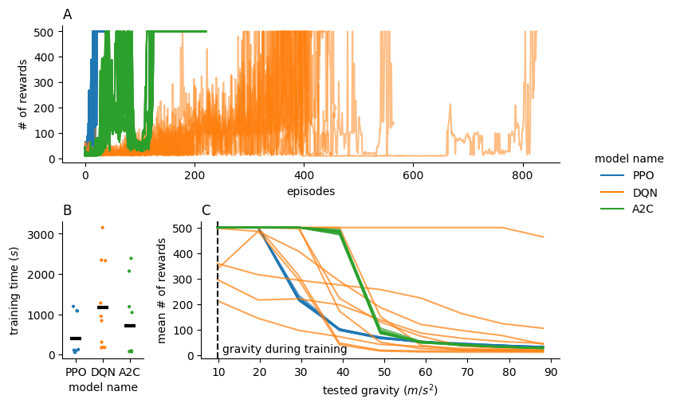

# Performance of different RL models on the CartPole task

## Problem statement

Here, I compare the performance of existing reinforcement learning models on the CartPole task. The tested models include PPO, DQN, and A2C.

## Methods

Each model was reinitialized and trained a total of ten times in the CartPole environment.
The hyperparameters for each model were selected according to the suggested hyperparameters from `https://github.com/DLR-RM/rl-baselines3-zoo/tree/master/hyperparams`.
During the test phase, the performance of each model was calculated by taking the average number of rewards obtained over 100 episodes in the CartPole environment. I also tested the performance of each model in gravity-modified CartPole environments from two to nine times Earth's gravity.

The project also includes code that allows training models, such as DDPG, in a modified CartPole environment with a continuous action space (see `rl_add/envs.py`). Here, the force applied to the cart is a multiple of the `force_mag` and `action` variable.

## Results

All three models are able to learn the task (Figure A). The DQN model shows more variability during training and takes more time to train than the other two models (Figure A and B). This variability is also evident after training as the DQN model has less consistent performance in standard gravity conditions (Figure C). When increasing gravity in the the CartPole task, the A2C and PPO models show a consistent performance drop (Figure C). Unlike the PPO model, A2C model performance remains robust up to five times Earth's gravity. The performance drop is variable across the trained DQN models when increasing gravity. One trained DQN model shows robust performance up to nine times Earth's gravity.



*Performance of the PPO, DQN, and A2C models on the CartPole task.*
(A) Number of rewards versus episode during the 10 different training sessions of each model. PPO: blue, DQN: orange, A2C: green.
(B) Total training time for the 10 different training sessions of each model. The black bar indicates the average training time for each model.
(C) Mean number of rewards obtained during the test phase across different gravity conditions in the CartPole task for each trained model. The vertical line indicates Earth's gravity - the gravity used during training. PPO: blue, DQN: orange, A2C: green.

## Installation

The conda environment and relevant packages can be installed using conda:

```bash
conda env create -f environment.yml
```

## Running models

To run the models and plot the results simply run the `analysis.ipynb` file.
To retrain and reevaluate the models set `rerun` to `True` in the parameter
settings in the `ipynb` file.  
